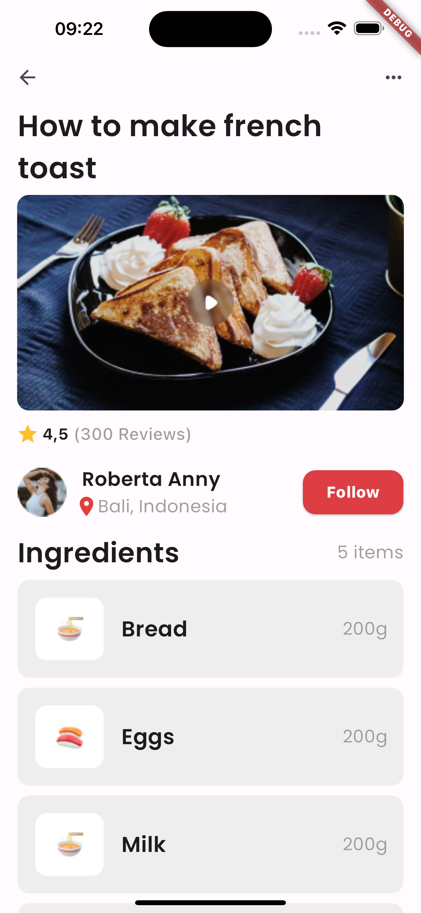

Title: Flutter Food Recipe Page Project

Introduction:
In this Flutter project, we aim to create a simple yet effective food recipe page where users can view a food recipe of thier choice, see the ingredients required to make the meal, view chef details and possibly follow the chef if they please, and even save their favorite recipes. This project will leverage Flutter's powerful UI toolkit to create an intuitive and visually appealing user interface.

